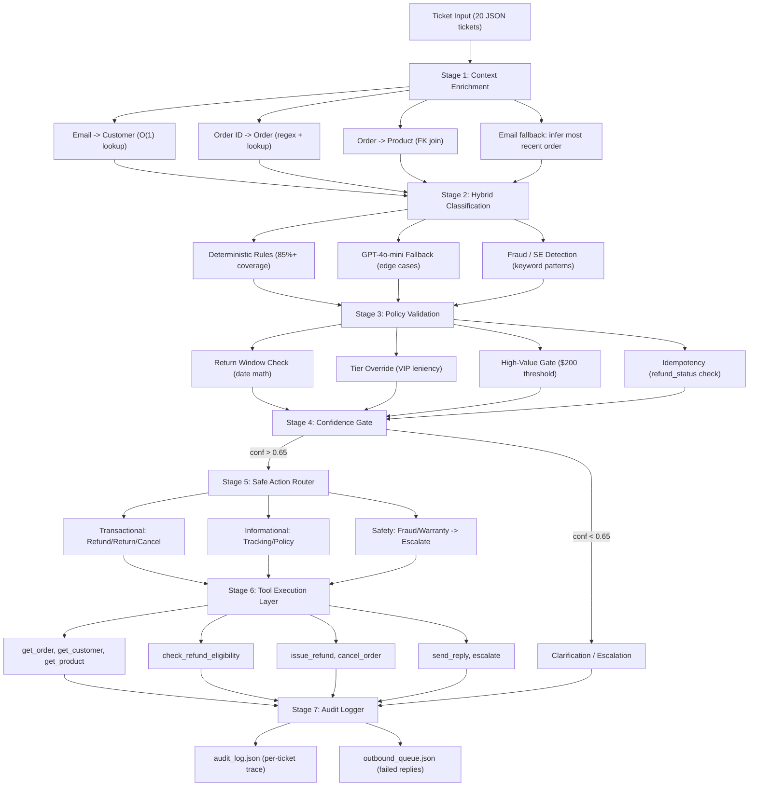

# ShopWave Architecture

## System Overview
The ShopWave Resolution Engine is a **7-stage autonomous pipeline** that decouples context enrichment, classification, policy validation, and tool execution into modular, testable layers.

## Pipeline Diagram

## Module Documentation

### `services/data_service.py`
- **Purpose**: O(1) indexed data access layer
- **Inputs**: JSON files from `data/` directory
- **Outputs**: Customer, Order, Product, Ticket objects
- **Key Decision**: Pre-indexed by email and order_id at load time for constant-time lookups

### `services/context_enrichment.py`
- **Purpose**: Resolve identity, order, and product context for each ticket
- **Inputs**: Raw Ticket
- **Outputs**: EnrichedTicket with full context
- **Key Decision**: When no order_id in ticket, infers most recent order from customer email

### `services/classifier.py`
- **Purpose**: Hybrid deterministic + LLM classification
- **Inputs**: Ticket text + enrichment context
- **Outputs**: ClassificationOutput (primary_class, tags, risk, confidence)
- **Key Decision**: Fraud detection keywords checked FIRST to override any other classification

### `services/policy_engine.py`
- **Purpose**: State-based eligibility validation
- **Inputs**: EnrichedTicket
- **Outputs**: PolicyValidation (eligible/blocked actions, reasons)
- **Key Decision**: VIP tier always gets extended return window regardless of deadline

### `agent/resolution_agent.py`
- **Purpose**: Core reasoning loop with per-intent handlers
- **Inputs**: List of EnrichedTickets
- **Outputs**: List of AuditLogEntry
- **Key Decision**: Every financial action requires ALL 5 guardrails to pass. Fallback to escalation on any failure.

### `tools/resolution_tools.py`
- **Purpose**: Mock implementations of 8 tools with realistic failure simulation
- **Inputs**: Tool-specific parameters
- **Outputs**: Tool-specific responses
- **Key Decision**: 15% timeout rate, 5% malformed data rate for realism

## Resilience Architecture

| Failure | Detection | Fallback |
|---|---|---|
| Tool Timeout | asyncio.TimeoutError after retry | Cache/snapshot/escalate |
| Malformed Data | Error key in response | Use enrichment snapshot |
| Send Reply Fail | 2 retries exhausted | outbound_queue.json |
| KB Timeout | Retry fails | Hardcoded POLICY_FALLBACK dict |
| Eligibility Timeout | Cannot verify | Escalate (never guess) |
| Invalid Order ID | get_order returns null | Block refund, ask for ID |
