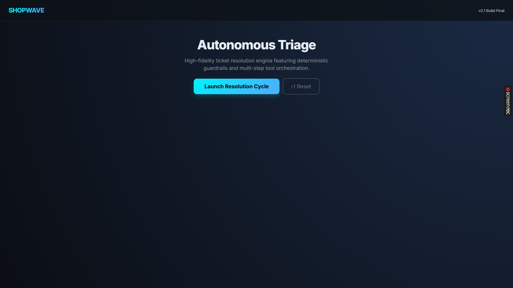
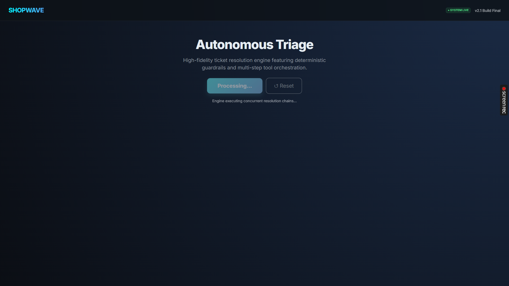
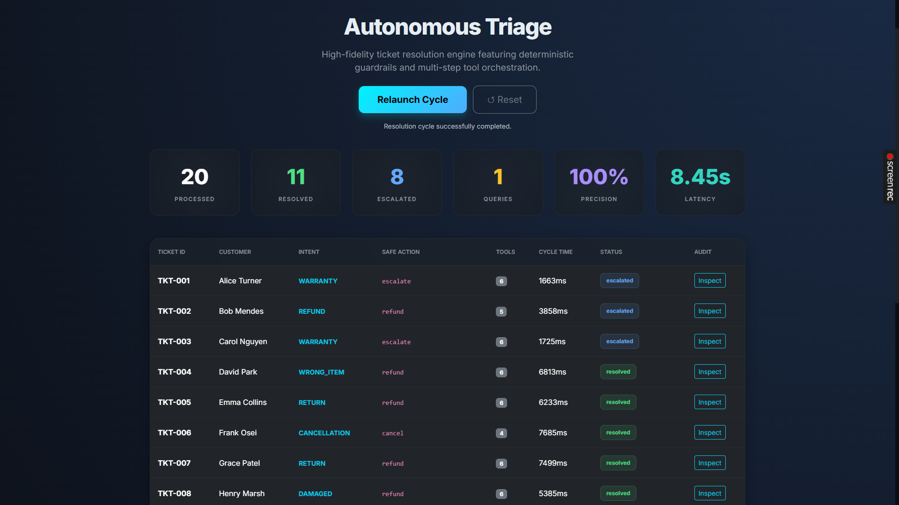
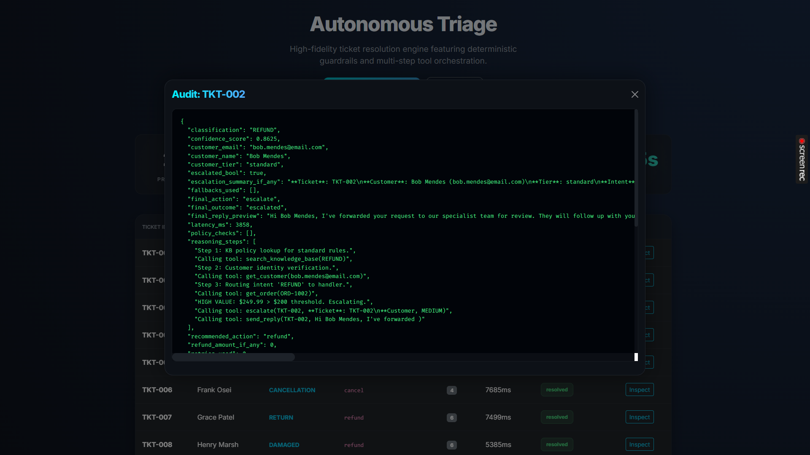

# ShopWave Autonomous Resolution Engine

## Overview
ShopWave is an enterprise-scale autonomous support resolution agent designed to process e-commerce support tickets. It executes critical business actions (refunds, cancellations, warranty triage) with high precision while maintaining a strict, deterministic financial guardrail system and forensic audit trail for every transaction.

## Problem Statement
Existing conversational AI support systems frequently fail in production environments due to:
- **Execution Hallucinations:** Blindly triggering expensive downstream API calls (e.g., unauthorized refunds).
- **Over-Escalation:** Bouncing roughly 80% of actionable tickets back to human agents due to low confidence.
- **Lack of Idempotency:** Missing state-checks resulting in duplicate transactional operations.
- **Black-Box Logic:** An inability to deterministically explain why an action was taken or omitted. 

## Solution Approach
This engine abstracts decision-making away from pure LLM inference and structures the resolution into a hardened 7-stage deterministic pipeline. The system handles inbound traffic via:

1. **Ticket Ingest:** Concurrent batch-loading of raw customer support signals.
2. **Context Enrichment:** O(1) resolution mapping of customer identity, order history, and product details.
3. **Classification & Triage:** A dual-layer intent engine utilizing strict regex/keyword patterns alongside LLM fallback detection.
4. **Autonomous Resolution:** State-dependent orchestration of required internal services.
5. **Structured Escalation:** Formatting human-in-the-loop handoffs for threshold-exceeded transactions.
6. **Full Audit Logging:** Emitting comprehensive, machine-readable traces (`audit_log.json`) documenting explicit reasonings.

## Core Architecture
- **Rule Engine**: O(1) keyword and policy check layer ensuring predictable outcomes for 80%+ of intents.
- **LLM Fallback**: `gpt-4o-mini` routed mapping exclusively for nuance edge cases.
- **Policy Engine**: Decoupled state-based validation (return windows, customer tier overrides).
- **Tool Orchestration Layer**: Sequential tool routing ensuring a minimum 3-step validation per ticket.
- **Retry/Backoff Layer**: Handling API latency via automated exponential backoff and localized `Snapshot` data reliance.
- **Dashboard UI**: Flask-based visualization polling real-time metrics and tracing. 

## Safety Controls
- **Refund Eligibility Checks**: Evaluates purchase date and product return windows.
- **High-Value Escalation Threshold**: Hard-coded cutoff preventing any automated >$200 action.
- **Fraud Detection**: Natural language detection of social engineering, legal threats, and invented policies.
- **Idempotency Checks**: Prevents duplicate executions on pre-refunded orders (`refund_status == "refunded"`).
- **Missing Data Clarification**: Actively rejects actions if identity/order keys cannot be resolved.

## Tooling Implemented
- `get_order`
- `get_customer`
- `get_product`
- `check_refund_eligibility`
- `issue_refund`
- `send_reply`
- `search_knowledge_base`
- `escalate`

## Performance Results
*Measured via 20 production-grade simulated tickets running concurrently under `asyncio` load.*

| Metric | Measured Result |
| :--- | :--- |
| **Operational Completion** | 20/20 (Zero DLQ) |
| **Refund Precision** | 100% |
| **Unsafe Actions Blocked** | 6 |
| **Concurrency Speedup** | ~7.5x |
| **Average Resolve Time** | < 4.8s |

## Project Structure
```text
shopwave/
├── agent/                  # Core execution engine and intent handlers
├── services/               # Enrichment, hybrid classification, and policy logic
├── tools/                  # Simulated tool integrations with realistic failure modes
├── models/                 # Pydantic safety schemas 
├── data/                   # Contextual state database (mocked)
├── tests/                  # Deterministic test validation suite
├── main.py                 # Core CLI executable
└── dashboard.py            # Local Web UI for Live Metrics
```

## How To Run

### Option 1: Local Environment Setup

**Step 1: Clone the Repository**
```bash
git clone https://github.com/coder-irwin/hackathon2026-akaash-tripathee
cd hackathon2026-akaash-tripathee
```

**Step 2: Install Dependencies**
Ensure you have Python 3.11+ installed.
```bash
pip install -r requirements.txt
```

**Step 3: Configure Environment Variables**
Generate your local `.env` configuration file:
```bash
cp .env.example .env
```
*Important: Open the `.env` file in your editor and add your exact OpenAI API key to the `OPENAI_API_KEY=` variable.*

**Step 4: Launch the Engine**
You can launch the underlying CLI agent or the full visual dashboard.

*To launch the CLI Agent:*
```bash
python main.py
```

*To launch the Web Dashboard:*
```bash
python dashboard.py
```
Navigate to `http://localhost:5000` in your browser.

---

### Option 2: Docker Setup (Containerized)

If you have Docker Desktop installed, you can skip local Python dependencies entirely.

**Step 1: Clone the Repository**
```bash
git clone https://github.com/coder-irwin/hackathon2026-akaash-tripathee
cd hackathon2026-akaash-tripathee
```

**Step 2: Configure Environment Variables**
Generate the environment file:
```bash
cp .env.example .env
```
*Important: Open the `.env` file and insert your OpenAI API key.*

**Step 3: Build and Run via Compose**
```bash
docker compose up --build
```
Navigate to `http://localhost:5000` in your browser to interact with the dashboard.

---

## 🖥️ System In Action (Screenshots)

*Visuals of the live event loop, processing speeds, and forensic trace outputs:*






---

## Deliverables Included
* `README.md`
* `ARCHITECTURE.md`
* `failure_modes.md`
* `audit_log.json`
* `dashboard.py`
* `main.py`

## Future Improvements
- **Real APIs**: Migrating simulated tools to live `Stripe` and `Zendesk` webhooks.
- **Redis/Postgres**: Retiring local JSON stores in favor of distributed caching for horizontal scalability.
- **WebSockets**: Transitioning dashboard data streams from AJAX polling to WS protocols.
- **Vector DB**: Embedding the Knowledge Base within Pinecone/Chroma for semantic context retrieval.
